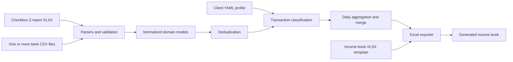

# Income Book Automation

[](https://github.com/mkandalov/income-book-automation/actions/workflows/ci.yml)

A production-oriented Python application that prepares Ukrainian income-book
workbooks from Checkbox Z-reports and bank statements. It replaces a repetitive
accounting workflow with deterministic parsing, validation, transaction
classification, daily aggregation, and Excel generation.

The project is based on a real workflow used by an accounting company serving
restaurants. All examples and automated tests use synthetic data; client files
and personal identifiers remain outside the repository.

## The problem

Accountants receive revenue data from several independent sources:

- Checkbox Z-reports with card, cash, and refund amounts;
- bank statements exported by different banks in incompatible CSV layouts;
- an existing income-book workbook whose structure and formatting must be
  preserved.

Combining these sources manually is slow and error-prone. This application
normalizes them into one domain model, applies explicit accounting rules, and
writes the resulting daily values into the existing workbook template.

## Current features

- FastAPI web interface with Ukrainian-language validation messages.
- Typer command-line interface for local and scripted use.
- Checkbox `.xlsx` Z-report parsing by header name, including reordered columns.
- CSV parsers for PUMB, PrivatBank, Monobank, and A-Bank.
- Processing of multiple bank statements, including different banks, in one run.
- Duplicate-file detection and transaction deduplication across overlapping
  statements.
- Deterministic classification of income, own-account transfers, excluded
  transactions, and transactions requiring manual review.
- Client-specific matching by tax ID, IBAN, legal name, and configured aliases.
- Ukrainian IBAN format and ISO 13616 checksum validation for statement and
  configured own accounts.
- Fail-closed validation for non-UAH statements, malformed CSV rows, incomplete
  credits, and conflicting counterparty identity data.
- Daily aggregation of Checkbox and eligible bank income using `Decimal`.
- Generation or update of an `.xlsx` income book without overwriting the source
  template.
- Configurable helper-column positions from J through O.
- Automatic monthly, quarterly, half-year, and year-to-date total rows when a new
  month is appended.
- Original upload filenames in user-facing validation errors.
- File-type, file-size, worksheet, and workbook-structure validation.
- Automated tests and GitHub Actions continuous integration.

## Architecture



The processing rules are deliberately separated from file parsing and delivery
interfaces. The same pipeline is therefore used by both the CLI and the web
application.

## Supported inputs

| Input | Supported format | Notes |
| --- | --- | --- |
| Checkbox | `.xlsx` | Checkbox Z-report with the required revenue and refund headers |
| PUMB | `.csv` | Statement export containing the PUMB transaction columns |
| PrivatBank | `.csv` | Signed transaction amounts are mapped to debit or credit |
| Monobank | `.csv` | The statement IBAN must be supplied separately |
| A-Bank | `.csv` | Account and currency are read from the metadata row |
| Client profile | `.yaml` or `.yml` | Identity and optional own-account/name aliases |
| Income-book template | `.xlsx` | Existing workbook and worksheet structure are preserved |

## Installation

The project requires Python 3.12+ and uses
[`uv`](https://docs.astral.sh/uv/) for dependency management.

```bash
git clone https://github.com/mkandalov/income-book-automation.git
cd income-book-automation
uv sync --all-groups
```

## Run the web application

```bash
uv run uvicorn income_book_automation.web.app:app --reload
```

Open [http://127.0.0.1:8000](http://127.0.0.1:8000) in a browser. The health
endpoint is available at [http://127.0.0.1:8000/health](http://127.0.0.1:8000/health).

One web request accepts:

1. a private client YAML profile;
2. between one and ten bank statement CSV files with a selected bank for each;
3. one Checkbox Z-report workbook;
4. one income-book template and its worksheet name;
5. optional helper-column positions and a custom output filename.

The generated workbook is returned as a download. Uploaded files are processed
inside a temporary directory and are removed when the request finishes.

## Client configuration

Client profiles are intentionally kept outside version control. A synthetic
example is available at `config/clients/client.example.yaml`:

```yaml
client_id: "client-001"
legal_name: "SOLE PROPRIETOR JOHN EXAMPLE"
tax_id: "0000000000"

own_accounts:
  - "UA273000010000000000000000001"
  - "UA973000010000000000000000002"

name_aliases:
  - "JOHN EXAMPLE"
  - "FOP JOHN EXAMPLE"
```

`own_accounts` and `name_aliases` are optional. Providing them improves detection
of transfers between the client's own accounts. The example uses synthetic
English names for readability; production values should exactly match the names
and identifiers used in the client's bank statements.

## CLI usage

Display all commands:

```bash
uv run income-book --help
uv run income-book generate --help
```

Generate a workbook from two statements:

```bash
uv run income-book generate \
  --config /path/to/client.yaml \
  --bank privat \
  --bank-statement /path/to/privat.csv \
  --bank pumb \
  --bank-statement /path/to/pumb.csv \
  --checkbox /path/to/checkbox-z-report.xlsx \
  --template /path/to/income-book-template.xlsx \
  --sheet 2026 \
  --output /path/to/generated-income-book.xlsx
```

The order of `--bank` values must match the order of `--bank-statement` values.
Add `--mono-account` once for every Monobank statement.

## Business-rule summary

- Checkbox card and cash income are calculated after their corresponding
  refunds.
- Debit transactions never contribute to income.
- Incoming transfers from the client's own IBAN, tax ID, legal name, or alias
  are not treated as income.
- Configured refund, returnable-financial-assistance, and currency-sale payment
  purposes are excluded.
- Credits without enough counterparty information are marked for manual review.
- A known own IBAN or client name paired with a different tax ID is marked for
  manual review instead of being silently excluded.
- Only UAH statements are accepted; other currencies stop the run.
- Only transactions classified as income contribute to daily bank totals.
- Dates whose combined Checkbox and bank income is zero are omitted.

See [`docs/rules.md`](docs/rules.md) for the complete rule order, spreadsheet
mapping, deduplication key, and current limitations.

## Excel output

The exporter processes one calendar month per run. It writes stable values into
the official income columns and uses formulas only where the template expects
derived values. The default helper mapping is:

| Column | Value |
| --- | --- |
| J | Total from all automated sources |
| K | Checkbox card income |
| L | Checkbox cash income |
| M | Eligible bank income |

The four helper columns can be assigned independently to any unique columns from
J through O in the web interface.

When the source template does not yet contain the requested later month, the
exporter copies the existing row style, appends daily rows, adds the required
period totals, and recalculates the year-to-date row.

## Quality checks

```bash
uv run ruff check src tests
uv run ruff format --check src tests
uv run pytest -q
```

The test suite contains more than 200 automated tests covering parsers,
validation, domain models, classification rules, deduplication, aggregation,
Excel export, CLI behavior, web uploads, error handling, and downloadable
responses.

GitHub Actions runs the same checks automatically for every pull request to
`main` and every push to `main`.

## Project structure

```text
src/income_book_automation/
├── parsers/       # Checkbox and bank-specific adapters
├── rules/         # Classification, aggregation, and deduplication
├── exporters/     # Income-book XLSX generation
├── validation/    # Reconciliation checks
├── web/           # FastAPI routes, upload handling, and templates
├── models.py      # Validated domain models
├── iban.py        # Ukrainian IBAN normalization and checksum validation
├── pipeline.py    # End-to-end orchestration
├── config.py      # Private YAML profile loading
└── cli.py         # Typer commands
```

## Privacy and safety

- Bank statements, Checkbox reports, income books, generated outputs, private
  profiles, and environment files are excluded by `.gitignore`.
- Tests generate temporary files from synthetic values and do not depend on
  real client documents.
- The original workbook is never used as the output path.
- Ambiguous transactions are separated for manual review rather than silently
  included as income.

## Current limitations

- This is an accounting-assistance tool, not a replacement for professional
  review or tax advice.
- A single run may contain data from only one calendar month.
- Bank statements must be CSV; Checkbox reports and templates must be XLSX.
- Only UAH bank transactions are supported. EUR, USD, and other currencies stop
  processing; currency conversion is not implemented.
- Output accuracy depends on the bank export layout and the configured client
  identity data.

## Roadmap

- Add a sanitized demo dataset and interface screenshot.
- Produce a downloadable audit report for included, excluded, duplicate, and
  manual-review transactions.
- Package the service with Docker.
- Deploy a demonstration environment and add continuous delivery.
- Add authentication and an organization-managed client allowlist.
