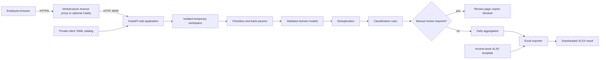

# Income Book Automation

[](https://github.com/mkandalov/income-book-automation/actions/workflows/ci.yml)

Income Book Automation is a production-oriented Python service that prepares
Ukrainian income-book workbooks from Checkbox Z-reports and bank statements. It
turns a repetitive accounting workflow into a deterministic pipeline with
strict input validation, transaction classification, daily aggregation, manual
review gates, and preservation of the existing Excel template.

The project is based on a real workflow used by an accounting company serving
restaurants. Client documents, personal identifiers, and production
configuration remain outside the repository. Tests and examples use synthetic
data only.

## The problem

Accountants need to combine three sources:

- a Checkbox Z-report containing card, cash, and refund values;
- one or more bank statements exported in bank-specific CSV layouts;
- an existing income-book workbook whose official structure and formatting
  must be preserved.

Manual processing is slow and makes it easy to count a refund, an own-account
transfer, a duplicate transaction, or a foreign-currency payment incorrectly.
This application validates the source files, normalizes every bank into one
domain model, applies explicit accounting rules, and produces a reviewable
`.xlsx` result.

## Employee workflow

The web interface guides an employee through one monthly processing run:

1. Search for and select a client from the server-managed client catalog.
2. Add between one and ten CSV statements and select the corresponding bank for
   each file. A Monobank statement also requires its statement IBAN.
3. Upload one Checkbox `.xlsx` Z-report and one `.xlsx` income-book template.
4. Select the worksheet, output filename, and four helper-column positions.
5. Generate and download the result.

If a credit cannot be classified safely, the application does not generate a
workbook. Instead, it displays a manual-review page with the original filename,
bank, CSV row, transaction details, and the missing or conflicting fields.

Negative daily Checkbox results are accepted and included, but the downloaded
workbook is accompanied by a visible warning. If no income is found, the
unchanged template is downloaded with a separate warning.

## Current features

- FastAPI web application with a Ukrainian-language interface and errors.
- Searchable client selector backed by private YAML profiles on the server.
- Typer CLI for local and scripted processing.
- Checkbox `.xlsx` Z-report parsing by normalized header name, including
  reordered columns and formula-cache validation.
- Strict CSV parsers for PUMB, PrivatBank, Monobank, and A-Bank.
- Multiple statements from one or several supported banks in a single run.
- File-level duplicate detection and transaction-level deduplication for
  overlapping statements.
- Deterministic categories: income, own transfer, excluded, and manual review.
- Client matching by tax ID, valid Ukrainian IBAN, exact normalized legal name,
  and configured aliases.
- Ukrainian IBAN format and ISO 13616 checksum validation.
- Fail-closed handling of malformed rows, missing financial data, mixed months,
  unsupported currencies, and conflicting counterparty identity.
- Daily aggregation with `Decimal` rather than binary floating-point values.
- `.xlsx` template update without overwriting the uploaded source file.
- Configurable helper columns from J through O.
- Monthly, quarterly, first-half-year, and year-to-date totals built from actual
  detected rows rather than fixed row offsets.
- Original upload filenames in user-facing errors.
- Client-profile generator for converting an administrative Excel register into
  validated private YAML files.
- Docker Compose packaging for infrastructure reverse proxies, with an
  optional Caddy profile for standalone internal HTTPS.
- GitHub Actions CI and a comprehensive automated test suite.

## Architecture



Parsing, domain rules, orchestration, Excel export, CLI delivery, and web
delivery are separate modules. Both the CLI and web application call the same
pipeline, so accounting decisions do not depend on the interface used.

## Supported inputs

| Input | Format | Important details |
| --- | --- | --- |
| Checkbox | `.xlsx` | Z-report containing the required revenue and refund headers |
| PUMB | `.csv` | Semicolon-delimited CP1251 transaction export |
| PrivatBank | `.csv` | Semicolon-delimited CP1251 export with signed amounts |
| Monobank | `.csv` | Semicolon-delimited UTF-8 export; statement IBAN is entered separately |
| A-Bank | `.csv` | Comma-delimited UTF-8 export; account and currency come from metadata |
| Client profile | `.yaml` / `.yml` | Stored privately on the server, not uploaded by employees |
| Income-book template | `.xlsx` | Existing workbook whose worksheet and styles are preserved |
| Generated result | `.xlsx` | New file; the uploaded template is never overwritten |

Every bank transaction must be in UAH. One run may contain only one calendar
month across all bank statements and the Checkbox report.

## Installation

The project requires Python 3.12+ and uses
[`uv`](https://docs.astral.sh/uv/) for dependency management.

```bash
git clone https://github.com/mkandalov/income-book-automation.git
cd income-book-automation
uv sync --all-groups
```

For the web interface, create the private catalog directory and copy the
synthetic example profile:

```bash
mkdir -p private_data/clients
cp config/clients/client.example.yaml private_data/clients/
```

## Run the web application locally

```bash
uv run uvicorn income_book_automation.web.app:app --reload
```

Open [http://127.0.0.1:8000](http://127.0.0.1:8000). The health endpoint is
available at
[http://127.0.0.1:8000/health](http://127.0.0.1:8000/health).

Uploads are copied into a request-specific temporary directory and removed when
processing finishes. The generated workbook is returned directly as a download
and is not stored by the web application.

## Run with Docker

```bash
cp .env.example .env
docker compose up -d --build
docker compose ps
```

By default, FastAPI is available at `http://127.0.0.1:8000`. The bind address is
configurable through `INCOME_BOOK_BIND_ADDRESS`. A production VM can publish
the port on its private interface so an existing infrastructure reverse proxy
can terminate HTTPS and forward requests to the application.

For a standalone deployment without an existing reverse proxy, start the
optional Caddy profile:

```bash
docker compose --profile internal-https up -d --build
```

The standalone local URL is `https://localhost`. Caddy uses its internal CA,
adds security headers, and proxies requests to FastAPI.

Production configuration, internal certificate installation, updates,
diagnostics, and rollback rules are documented in
[`docs/deployment.md`](docs/deployment.md).

## Client configuration

Client profiles are deliberately kept outside Git and the Docker image. A
synthetic example is available at `config/clients/client.example.yaml`:

```yaml
client_id: "client-001"
legal_name: "SOLE PROPRIETOR JOHN EXAMPLE"
tax_id: "0000000000"

own_accounts:
  - "UA273000010000000000000000001"
  - "UA973000010000000000000000002"

name_aliases:
  - "JOHN EXAMPLE"
  - "FOP JOHN EXAMPLE"
```

`own_accounts` and `name_aliases` are optional. Adding known accounts and exact
bank-statement name variants improves own-transfer detection. The web catalog
exposes only a display name and an opaque derived selector ID; the tax ID and
internal profile ID are not embedded in the page.

An administrator can generate profiles from an Excel register containing a
full-name column (`ПІБ`, `ФІО`, or `ФИО`) and a tax-ID column (`ІПН`, `ИНН`, or
`РНОКПП`):

```bash
uv run generate-client-profiles \
  --input /path/to/client-register.xlsx \
  --output /path/to/empty/client-directory \
  --dry-run

uv run generate-client-profiles \
  --input /path/to/client-register.xlsx \
  --output /path/to/empty/client-directory
```

The generator validates every row and duplicate tax IDs before writing any
files. It refuses to write into a directory that already contains YAML profiles.

## CLI usage

Display the available commands:

```bash
uv run income-book --help
uv run income-book generate --help
```

Generate a workbook from two bank statements:

```bash
uv run income-book generate \
  --config /path/to/client.yaml \
  --bank privat \
  --bank-statement /path/to/privat.csv \
  --bank pumb \
  --bank-statement /path/to/pumb.csv \
  --checkbox /path/to/checkbox-z-report.xlsx \
  --template /path/to/income-book-template.xlsx \
  --sheet 2026 \
  --output /path/to/generated-income-book.xlsx
```

The order of `--bank` values must match the order of `--bank-statement` values.
Provide one `--mono-account` value for every Monobank statement, in Monobank
statement order.

## Business-rule summary

- Checkbox card and cash income equal revenue minus the corresponding refund.
- A negative daily Checkbox net value is retained and reported as a warning.
- Debit bank transactions are excluded before credit-classification rules run.
- A credit missing a document number, counterparty, counterparty account,
  counterparty tax ID, or payment purpose is sent to manual review and blocks
  export.
- Incoming transfers identified as the client's own funds by account, tax ID,
  legal name, or exact alias are not income.
- Conflicting client identifiers are sent to manual review rather than silently
  included or excluded.
- Refunds, returnable financial assistance, and currency-sale proceeds are
  excluded by normalized payment-purpose rules.
- Only transactions classified as income contribute to daily bank totals.
- A date is omitted only when card net, cash net, and eligible bank income are
  all individually zero. Offsetting positive and negative components are kept.
- If no daily entries remain, the application returns an unchanged copy of the
  template and shows a warning.

See [`docs/rules.md`](docs/rules.md) for the complete order, validation policy,
deduplication key, Excel mapping, period-total logic, and error behavior.

## Excel output

The exporter handles one calendar month per run. The official columns are
independent from the removable helper columns:

| Column | Written value |
| --- | --- |
| A | Date |
| B | Stable numeric total income |
| C | `0.00` in the current MVP |
| D | Formula `B - C` |
| E | `0.00` in the current MVP |
| F | Formula `D + E` |
| G | `0.00` in the current MVP |
| H | `0.00` in the current MVP |
| I | Cleared reserved column |

Default helper mapping:

| Column | Written value |
| --- | --- |
| J | Formula: Checkbox card + Checkbox cash + eligible bank income |
| K | Checkbox card net |
| L | Checkbox cash net |
| M | Eligible bank income |

The four helper values may be assigned to any four unique columns from J through
O. Column B receives a numeric value, not a reference to J, so removing helper
columns does not break the official income amount.

When appending a later month, summary formulas reference the actual discovered
monthly-total rows. They never rely on a fixed number of day rows, which is
important because zero-income days are omitted.

## Quality checks

```bash
uv run ruff check src tests
uv run ruff format --check src tests
uv run pytest -q
docker compose config --quiet
```

The suite currently contains 250 automated tests covering parsers, malformed
inputs, validation, domain models, IBAN checks, classification, deduplication,
aggregation, Excel export, client configuration, CLI behavior, web requests,
review pages, warnings, and downloads.

GitHub Actions executes locked dependency installation, Ruff checks, formatting
verification, and the complete test suite for every pull request to `main` and
every push to `main`.

## Project structure

```text
src/income_book_automation/
├── parsers/                  # Checkbox and bank-specific adapters
├── rules/                    # Classification, deduplication, aggregation
├── exporters/                # Income-book XLSX generation
├── validation/               # Reconciliation checks
├── web/                      # FastAPI routes, processing, templates, CSS
├── models.py                 # Validated domain models
├── iban.py                   # Ukrainian IBAN validation
├── pipeline.py               # End-to-end orchestration
├── config.py                 # Private YAML catalog loading
├── client_profile_generator.py
└── cli.py
```

## Privacy and security

- Real bank statements, Checkbox reports, templates, outputs, client profiles,
  environment files, and certificates are excluded from Git.
- Tests use temporary synthetic documents and identifiers.
- Client profiles are mounted read-only into the application container.
- The original workbook is never used as the output path.
- Uploaded files live only in an isolated temporary request directory.
- TLS terminates at the configured reverse proxy. Port 8000 binds to loopback
  by default and must be limited to the private interface and trusted proxy
  network when it is exposed on a production VM.
- Ambiguous credits fail closed and require human review.

HTTPS protects traffic but does not authenticate a person. The current internal
deployment must therefore also be restricted by network/firewall policy until
application authentication and authorization are added.

## Current limitations

- This is an accounting-assistance tool, not a replacement for professional
  accounting review or tax advice.
- A run may contain data from only one calendar month.
- Bank statements must be CSV; Checkbox reports and templates must be XLSX.
- Only UAH bank transactions are supported.
- Client creation and removal are administrative YAML workflows; there is no
  client-management web page yet.
- The web application has no user login or role model yet.
- The generated workbook contains formulas, but `openpyxl` does not calculate
  them. Microsoft Excel may show blank cached formula values in Protected View
  until the employee enables editing and Excel recalculates the workbook.
- The result contains the prepared workbook but not a separate downloadable
  audit report for every included and excluded transaction.

## Roadmap

- Add authentication, authorization, and an organization-managed access policy.
- Add an administrator workflow for creating, updating, and removing clients.
- Produce a downloadable audit report for included, excluded, duplicate, and
  manual-review transactions.
- Add a sanitized demo dataset and interface screenshots.
- Add automated continuous delivery after the manual production-update process
  has been proven stable.
